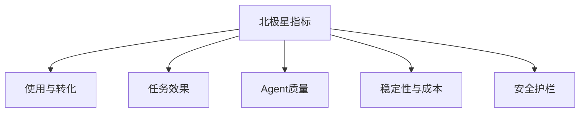
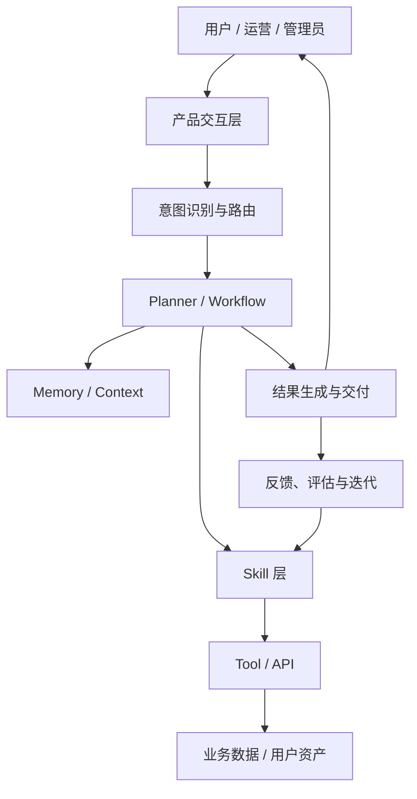
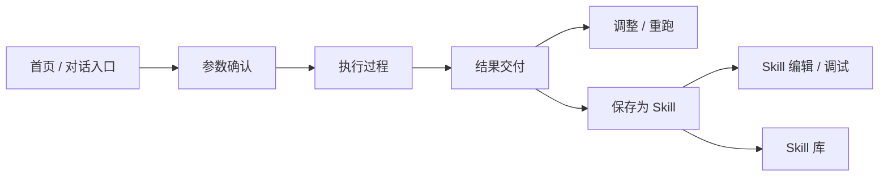
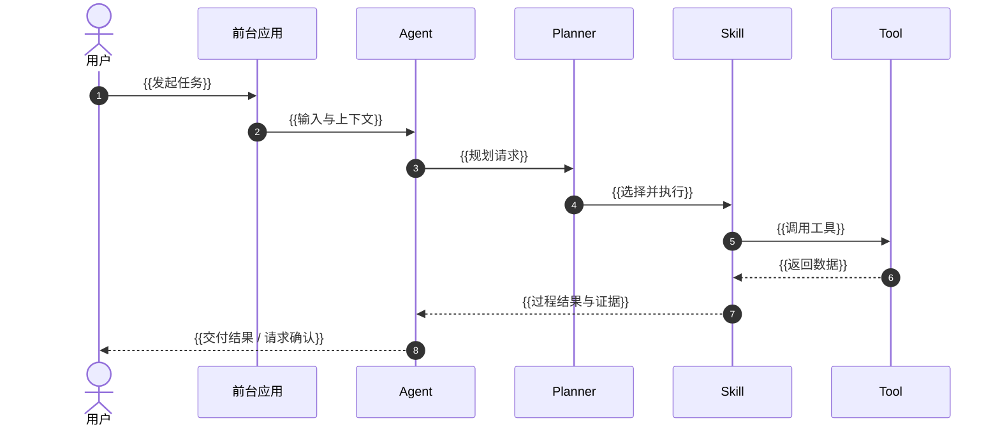
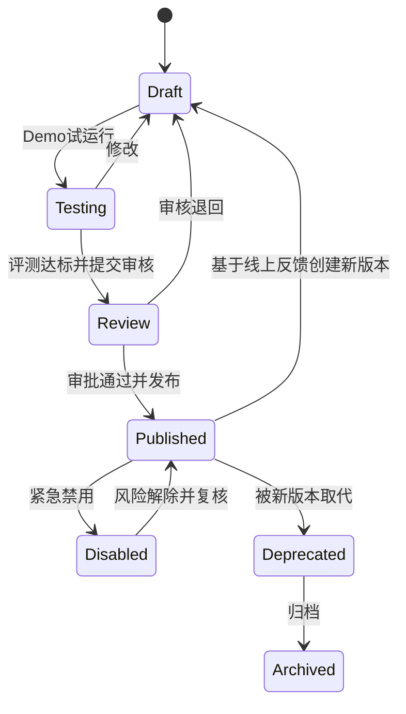
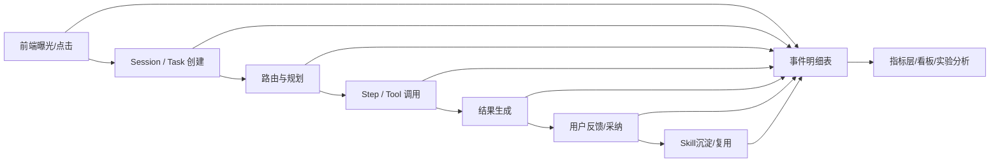

# Agent 产品 PRD 写作模板

> 适用范围：用户可感知的 Agent、Copilot、Workflow、Skill、AI 原生工作台等业务产品需求。
>
> 使用方式：完整项目复制“模板正文”，替换 `{{...}}`；标有“按需”的章节不涉及时写明原因。课程按下方说明分阶段使用。PRD 要回答四件事：**为什么做、做什么、系统如何表现、如何证明做成了。**

## 课程使用说明

本文件是完整 PRD 的参考框架。Day 03 先了解目录和交付要求，再用同一条需求完成“功能推导 → 业务版 PRD 初稿”。

| 材料 | 本次怎么用 |
| --- | --- |
| **① PRD 写作模板（本文件）** | 看全貌，理解最终还要回答哪些问题；正文按阶段查阅、补充。 |
| [② 业务版 PRD 编写指南与示例](<Day03业务版PRD编写指南.md>) | 了解为什么先写业务版，参照同一功能方案的示例成文。 |
| [③ 一条需求怎样变成功能](<Day03产品功能设计.md>) | 老师演示从运营需要推导用户流程、功能及首版取舍。 |

**课堂顺序：①浏览框架 → ③推导功能 → ②写业务版 PRD。** 当天交一份业务版 PRD 初稿，先写清背景、范围、流程与功能、关键规则、验收及待确认事项。业务版是本模板分阶段填写的起点，后续在同一份文档中逐步补全。

本例聚焦日常竞品跟踪的价格／促销事件；②与③统一使用 F1–F4。结果来源、缺失信息、失败处理和人工决定现在就要写清。具体 AI 交互、架构与路由、模型选型、数据及质量评测随课程补充；未知项注明待补与影响，不凭空填写。未实现能力和教学模拟须明确标识，进入实现前补齐影响交付的规格。

---

## 一、写作原则

### 1. 从结论到细节

评审人应在前 3 分钟内看懂：解决谁的什么问题、本期做什么和不做什么、成功如何衡量、最大的风险与待决策项是什么。

推荐叙事顺序：

```text
现象与证据 → 根因 → 产品判断 → 目标与非目标 → 产品机制
→ 功能与交互规则 → 数据与埋点 → 验收 → 灰度与复盘
```

### 2. 战略文档和模块 PRD 分层

战略层回答“这是一个什么 Agent、为什么值得做、核心模块如何协同”；模块 PRD 回答“某个模块具体如何实现和验收”。如果两类内容必须放在同一份文档，战略部分控制在总篇幅的 20% 以内，其余写到功能、规则、数据和验收颗粒度。

### 3. 一条需求必须形成闭环

每个功能点至少能串起：

```text
用户场景 → 触发条件 → 输入 → Agent/系统动作 → 人工确认点
→ 输出 → 异常降级 → 数据记录 → 验收标准
```

### 4. 避免模糊主语和形容词验收

不要写“系统自动处理”“体验良好”“智能推荐”“准确率较高”。应明确哪个应用或 Agent 在什么条件下采取什么动作，并用可观测结果验收。

### 5. 先编号，再写正文

为了让研发、测试、数据使用同一套语言，建议从初稿开始固定编号：业务目标 `OBJ-001`、指标 `MET-001`、功能需求 `FR-001`、规则 `RULE-001`、埋点事件 `EV-001`、验收标准 `AC-001`、风险 `RISK-001`、待确认项 `OQ-001`。编号一旦进入评审就不要复用或重排；删除项保留编号并标记“已废弃”。

PRD 的最终闭环应能沿编号追踪：

```text
用户问题 → OBJ → FR / RULE → MET → EV → AC → 灰度门槛
```

---

# 模板正文

# [PRD] {{需求名称}}

| 项目 | 内容 |
| --- | --- |
| 文档作者 | {{姓名}} |
| 创建日期 | {{YYYY-MM-DD}} |
| 当前版本 | {{v0.1}} |
| 文档状态 | 草稿 / 评审中 / 已通过 / 已上线 / 已归档 |
| 所属产品 / 业务线 | {{产品或业务线}} |
| 需求负责人 | {{姓名 / 工号}} |
| 关联需求 | {{Aone / 项目链接；无则填 —}} |
| 设计稿 | {{链接及状态}} |
| 技术方案 | {{链接；未产出则写计划时间}} |
| 数据负责人 | {{姓名 / 工号}} |
| 上线目标时间 | {{YYYY-MM-DD}} |

## 0. 一页摘要

> 本节应在评审前最后填写，控制在一屏内。

| 问题 | 结论 |
| --- | --- |
| 为谁解决什么问题 | {{目标用户 + 高频场景 + 当前阻碍}} |
| 核心产品判断 | {{为什么 Agent/Skill/Workflow 是合适解法}} |
| 本期交付 | {{3-5 项核心能力}} |
| 本期不做 | {{至少 2 项明确边界}} |
| 北极星指标 | {{指标、基线、目标值、观察周期}} |
| 关键里程碑 | {{评审 / 提测 / 灰度 / 全量时间}} |
| 最大风险 | {{最可能导致需求失败的一项风险及对策}} |
| 待决策事项 | {{需要在评审会上拍板的问题}} |

### 0.1 修订记录

| 版本 | 日期 | 修改人 | 变更类型 | 涉及章节 | 改了什么 | 为什么改 / 决策依据 |
| --- | --- | --- | --- | --- | --- | --- |
| v0.1 | {{日期}} | {{姓名}} | 新增 | 全部 | 初稿 | {{需求来源}} |
| v0.2 | {{日期}} | {{姓名}} | 新增 / 修改 / 删除 / 澄清 | {{如 7.2、10.1}} | {{具体变化}} | {{评审纪要或决策人}} |

> 版本规则：评审通过前用 v0.x；首次定稿为 v1.0；不影响实现的小修改升小版本；影响范围、流程、字段或接口的修改升大版本。历史记录只追加，不擦除。

---

## 1. 需求背景与机会判断

### 1.1 现状与问题

{{描述用户当前如何完成任务、在哪一步遇到什么问题。不要在这里提前写产品功能。}}

建议使用“现象—证据—根因”结构：

| 层次 | 内容 |
| --- | --- |
| 现象 | {{用户可观察的问题}} |
| 证据 | {{数据、访谈、工单、行为日志、案例；附来源}} |
| 直接原因 | {{流程或产品层原因}} |
| 根因 | {{能力、数据、组织或机制层原因}} |
| 不解决的代价 | {{用户损失、业务损失、机会成本}} |

### 1.2 当前解决方式与不足

| 用户 / 角色 | 当前做法 | 时间或资金成本 | 成功率 / 效果 | 主要不足 |
| --- | --- | --- | --- | --- |
| {{角色}} | {{人工流程或已有工具}} | {{数字}} | {{数字}} | {{不足}} |

### 1.3 为什么现在做

{{写明外部变化、内部能力成熟、用户需求增长、战略窗口或上游 deadline。}}

### 1.4 参考资料与输入来源

| 类型 | 标题 | 链接 | 本文复用内容 |
| --- | --- | --- | --- |
| 初始需求 | {{会议纪要 / 原始需求}} | {{链接}} | {{}} |
| 数据证据 | {{看板 / 调研}} | {{链接}} | {{}} |
| 历史 PRD | {{标题}} | {{链接}} | {{术语 / 规则 / 接口}} |
| 竞品 / 行业 | {{标题}} | {{链接}} | {{}} |

---

## 2. 产品定义与边界

### 2.1 一句话定位

> 为 {{目标用户}}，在 {{核心场景}} 下，提供 {{核心能力}}，帮助其 {{可衡量价值}}；区别于 {{现有方案}}，本产品通过 {{关键机制 / 壁垒}} 实现。

### 2.2 核心概念与术语

> 对 Task、Workflow、SOP、Skill、Tool、Agent、Memory 等易混概念必须给出唯一口径。

| 术语 | 定义 | 与其他概念的边界 | 产品中的实例 |
| --- | --- | --- | --- |
| {{术语}} | {{定义}} | {{不是什么}} | {{实例}} |

### 2.3 产品价值

| 对象 | 当前损失 | 产品提供的价值 | 价值衡量指标 |
| --- | --- | --- | --- |
| 用户 | {{}} | {{}} | {{}} |
| 业务 | {{}} | {{}} | {{}} |
| 平台 / 生态 | {{}} | {{}} | {{}} |

### 2.4 产品边界

**In-Scope**

- {{本期包含的用户、场景、渠道、模块、数据范围}}
- {{至少写到功能颗粒度}}

**Non-Goals / Out-of-Scope**

- {{明确不做什么，以及为什么不做}}
- {{至少 2 条，避免评审时范围膨胀}}

**后续阶段**

| 能力 | 本期状态 | 后续阶段 | 进入下一阶段的条件 |
| --- | --- | --- | --- |
| {{能力}} | 不做 / 验证 / MVP / 完整 | {{阶段}} | {{指标或前置依赖}} |

---

## 3. 目标、指标与护栏

### 3.1 业务目标

| 目标 ID | 目标 | 当前基线 | 目标值 | 截止时间 | 目标人群 / 范围 | 负责人 |
| --- | --- | --- | --- | --- | --- | --- |
| OBJ-001 | {{目标}} | {{基线}} | {{目标}} | {{日期}} | {{范围}} | {{姓名}} |

### 3.2 指标树



### 3.3 指标定义表

> 每个指标必须具备：业务含义、计算公式、统计粒度、去重对象、时间窗口、数据源、基线样本、目标和负责人。只写“提升使用率”不算指标。

| 指标 ID | 层级 | 指标名称 | 业务含义 | 计算公式 | 统计粒度 | 去重对象 | 观察 / 归因窗口 | 数据源（事件 ID） | 基线值（周期 / 样本） | 目标值（截止时间） | 护栏值 | 负责人 |
| --- | --- | --- | --- | --- | --- | --- | --- | --- | --- | --- | --- | --- |
| MET-001 | 北极星 | {{有效任务完成率}} | {{用户真正获得合格结果的比例}} | {{EV-008.final_status=Completed 且 EV-010.quality_label=pass 的任务数 / EV-002 有效发起任务数}} | 日 / 周 | task_id | {{结果延迟归因窗口}} | EV-002、EV-008、EV-009、EV-010 | {{数值；周期；人群；过滤条件}} | {{数值；日期}} | {{}} | {{}} |
| MET-002 | 使用 | {{首用转化率}} | {{}} | {{首次质量合格用户数 / 进入功能新用户数}} | 周 Cohort | user_id | {{7日}} | EV-001、EV-002、EV-010 | {{}} | {{}} | {{}} | {{}} |
| MET-003 | 留存 | {{7日复用率}} | {{}} | {{首用后第 1-7 天再次质量合格的用户数 / 首次质量合格用户数}} | 周 Cohort | user_id | {{D1-D7}} | EV-010、EV-015 | {{}} | {{}} | {{}} | {{}} |
| MET-004 | 效果 | {{人工耗时下降率}} | {{}} | {{基线人工耗时-本期人工耗时）/基线人工耗时}} | 月 | task_id | {{30日}} | EV-011 | {{}} | {{}} | {{}} | {{}} |
| MET-005 | Agent质量 | {{结果采纳率}} | {{}} | {{feedback_type=direct_accept，或 feedback_type=edited_accept 且 edit_ratio≤约定阈值的任务数 / 已曝光结果任务数}} | 周 | task_id | {{结果曝光后 7 日}} | EV-009、EV-012 | {{}} | {{}} | {{}} | {{}} |
| MET-006 | 稳定性 | {{任务技术成功率}} | {{}} | {{EV-008.final_status=Completed 的任务数 / 进入执行任务数}} | 日 | task_id | 同日 | EV-006、EV-008 | {{}} | {{}} | {{}} | {{}} |
| MET-007 | 性能 | {{P95 完成时延}} | {{}} | {{EV-008.end_time - EV-006.start_time 的 P95}} | 日 | task_id | 同日 | EV-006、EV-008 | {{}} | {{}} | {{}} | {{}} |
| MET-008 | 成本 | {{单次有效任务成本}} | {{}} | {{模型+工具+基础设施成本 / 质量合格任务数}} | 周 | task_id | 同周 | EV-005、EV-008、EV-010 | {{}} | {{}} | {{}} | {{}} |
| MET-009 | 安全 | {{高风险误执行率}} | {{}} | {{未获有效确认且实际执行的高风险动作数 / 高风险动作执行数}} | 日 | risk_action_id | 同日 | EV-013 | {{}} | 0；{{日期}} | 0 | {{}} |
| MET-010 | 路由质量 | {{Skill 路由 Top-1 准确率}} | {{}} | {{Top-1 选择与人工标签一致的路由数 / 有标签路由数}} | 评测批次 / 周 | route_attempt_id | 同批次 / 同周 | EV-003 | {{}} | {{}} | {{}} | {{}} |
| MET-011 | 确认体验 | {{确认完成率}} | {{}} | {{EV-004.action=confirm 的任务数 / EV-016 确认卡曝光任务数}} | 周 | task_id | 同 Session | EV-004、EV-016 | {{}} | {{}} | {{}} | {{}} |
| MET-012 | 执行质量 | {{Step 成功率}} | {{}} | {{status=success 的 Step 数 / 执行 Step 数}} | 日 | task_id+step_id | 同任务 | EV-007 | {{}} | {{}} | {{}} | {{}} |
| MET-013 | 工具质量 | {{Tool 调用成功率}} | {{}} | {{status=success 的 Tool 调用数 / Tool 调用数}} | 日 | call_id | 同日 | EV-005 | {{}} | {{}} | {{}} | {{}} |
| MET-014 | 沉淀转化 | {{Skill 保存成功率}} | {{}} | {{status=success 的保存数 / 发起保存数}} | 周 | skill_draft_id | 同创建流程 | EV-014 | {{}} | {{}} | {{}} | {{}} |

### 3.4 指标口径特别说明

- **分母定义**：{{哪些行为算“发起任务”；预览、误触、测试账号是否排除}}
- **成功定义**：{{技术完成、业务完成、用户确认完成分别如何定义}}
- **质量定义**：{{由规则、人工标注、LLM-as-Judge 还是业务结果判定}}
- **去重与归因**：{{按 user_id / session_id / task_id；跨端如何归一}}
- **观察窗口**：{{当天、7日、30日；延迟结果如何补记}}
- **实验分组**：{{实验层级、互斥域、分流方式}}
- **数据延迟与修正**：{{T+0/T+1；重跑、补数和撤销如何处理}}

### 3.5 反指标与护栏

| 护栏 | 不得恶化到 | 触发后的动作 |
| --- | --- | --- |
| 用户投诉率 | {{阈值}} | {{停止灰度 / 人工复核}} |
| 错误执行率 | {{阈值}} | {{关闭自动执行，退化为建议模式}} |
| P95 时延 | {{阈值}} | {{限流 / 切模型 / 降级}} |
| 单任务成本 | {{阈值}} | {{调整上下文、模型或工具调用}} |

---

## 4. 用户、场景与旅程

### 4.1 用户分层

| 用户类型 | 关键特征 | 任务复杂度 | 数字化基础 | 核心诉求 | 产品策略 |
| --- | --- | --- | --- | --- | --- |
| {{用户 A}} | {{}} | 高 / 中 / 低 | 高 / 中 / 低 | {{}} | {{}} |

### 4.2 Persona

| 项目 | 内容 |
| --- | --- |
| 身份与业务 | {{}} |
| 高频目标 | {{}} |
| 现有工作流 | {{}} |
| 最大阻碍 | {{}} |
| 可提供的数据 / 方法 | {{}} |
| 对自动化的信任边界 | {{哪些动作必须确认}} |
| 成功时刻（Wow Moment） | {{用户何时第一次感到产品有价值}} |

### 4.3 核心场景矩阵

| 场景 | 用户任务 | 触发信号 | 发生频率 | 用户价值 | AI 杠杆 | 数据可得性 | 风险 | 优先级 |
| --- | --- | --- | --- | --- | --- | --- | --- | --- |
| {{场景}} | {{JTBD}} | {{用户主动 / 系统触发}} | {{}} | {{}} | {{}} | {{}} | {{}} | P0/P1/P2 |

### 4.4 用户故事

- 作为 {{角色}}，当 {{情境}} 时，我希望 {{能力}}，以便 {{可验证价值}}。
- 作为 {{角色}}，当 {{异常或数据不足}} 时，我希望 {{可控行为}}，以便 {{避免损失}}。
- 作为 {{管理员 / 协作者}}，我希望 {{管理或审核能力}}，以便 {{治理价值}}。

### 4.5 端到端用户旅程

| 阶段 | 用户目标 | 用户动作 | Agent / 系统动作 | 人工确认点 | 输出物 | 情绪 / 痛点 | 关键埋点 |
| --- | --- | --- | --- | --- | --- | --- | --- |
| 发现 | {{}} | {{}} | {{}} | {{}} | {{}} | {{}} | {{}} |
| 首次配置 | {{}} | {{}} | {{}} | {{}} | {{}} | {{}} | {{}} |
| 执行 | {{}} | {{}} | {{}} | {{}} | {{}} | {{}} | {{}} |
| 调整 | {{}} | {{}} | {{}} | {{}} | {{}} | {{}} | {{}} |
| 沉淀 / 复用 | {{}} | {{}} | {{}} | {{}} | {{}} | {{}} | {{}} |

---

## 5. 产品机制与整体架构

### 5.1 核心机制

> 用 3-5 条讲清产品如何创造价值，不要罗列页面。例如：“将用户经营档案作为跨 Skill 共享语义记忆；将执行轨迹作为情景记忆；经用户确认后才提炼为可复用 Skill。”

1. {{机制一}}
2. {{机制二}}
3. {{机制三}}

### 5.2 能力分层

| 层级 | 定义 | 本期能力 | 依赖 | 示例 |
| --- | --- | --- | --- | --- |
| 业务任务层 | {{用户直接购买或使用的任务}} | {{}} | {{}} | {{}} |
| SOP / Workflow 层 | {{结构化任务步骤}} | {{}} | {{}} | {{}} |
| Skill 层 | {{可复用程序性能力}} | {{}} | {{}} | {{}} |
| Tool / Data 层 | {{工具、接口与数据}} | {{}} | {{}} | {{}} |

### 5.3 产品架构图



### 5.4 Agent 与人工边界

| 环节 | Agent 可以自动做 | 必须人工确认 | 禁止自动执行 | Risk Gate |
| --- | --- | --- | --- | --- |
| {{环节}} | {{}} | {{}} | {{}} | {{确认条件、权限、金额或影响范围}} |

---

## 6. 信息架构与页面 / 入口

### 6.1 页面地图



### 6.2 页面清单

| 页面 / 入口 | 页面目标 | 目标用户 | 核心组件 | 进入条件 | 离开条件 | 对应需求章节 |
| --- | --- | --- | --- | --- | --- | --- |
| {{页面}} | {{}} | {{}} | {{}} | {{}} | {{}} | {{7.x}} |

### 6.3 跨页面规则

- 返回页面时如何恢复对话、任务和草稿状态：{{}}
- 任务后台执行时如何通知：{{}}
- 历史对话是否只读：{{}}
- 有未保存修改时如何拦截：{{}}
- 多端打开或并发编辑如何处理：{{}}

---

## 7. 功能需求详述

> 每个核心功能复制一份 7.x 模板。一个功能必须同时写清正常流、状态变化、异常流、数据规则和验收编号。

### 7.1 {{功能名称}}

| 项目 | 内容 |
| --- | --- |
| 需求 ID | FR-001 |
| 优先级 | P0 / P1 / P2 |
| 关联目标 / 指标 | OBJ-{{}} / MET-{{}} |
| 关联验收 | AC-{{}} |
| 负责人 | {{实名}} |

#### 7.1.1 功能目标

{{一句话说明解决什么场景，不重复背景。}}

#### 7.1.2 承接系统与责任边界

| 应用 / 系统 | 在本功能中的角色 | 改造类型 | 责任团队 |
| --- | --- | --- | --- |
| {{应用}} | {{入口 / 编排 / 执行 / 数据源 / 通知}} | 新增 / 改造 / 仅调用 | {{团队}} |

#### 7.1.3 前置条件与触发入口

| 项目 | 说明 |
| --- | --- |
| 前置条件 | {{账号、权限、数据、版本、安装状态}} |
| 用户触发 | {{入口与具体操作}} |
| 系统触发 | {{事件、定时或规则触发；无则填不涉及}} |
| 频控 / 配额 | {{}} |

#### 7.1.4 主流程



#### 7.1.5 交互规格

| 状态 / 场景 | 曝光内容 | 用户可操作项 | Agent / 系统响应 | 优先级 | 埋点 | 验收编号 |
| --- | --- | --- | --- | --- | --- | --- |
| {{首次进入}} | {{}} | {{}} | {{}} | P0/P1/P2/P3 | {{event}} | AC-{{}} |
| {{等待确认}} | {{}} | {{确认 / 修改 / 跳过}} | {{}} | {{}} | {{}} | {{}} |
| {{执行中}} | {{步骤、数据源、进度、耗时}} | {{中断 / 追问 / 上传}} | {{}} | {{}} | {{}} | {{}} |
| {{完成}} | {{结果与来源}} | {{调整 / 导出 / 沉淀}} | {{}} | {{}} | {{}} | {{}} |

#### 7.1.6 任务执行状态机

> 不只画状态名称；必须定义事件、守卫条件、系统动作和下一状态。这里仅描述 **Task 执行状态**，保存为 Skill 是 Task 完成后的独立业务动作，不进入本状态机。

| 当前状态 | 触发事件 | 守卫条件 | 系统动作 | 下一状态 | 用户可见反馈 | 超时 / 失败处理 |
| --- | --- | --- | --- | --- | --- | --- |
| Idle | 提交任务 | 输入有效且有权限；若无需确认 | 创建 task_id 与执行快照 | Running | {{开始执行}} | {{}} |
| Idle | 提交任务 | 参数缺失或风险规则要求确认 | 创建 task_id 与确认轮次 | Confirming | {{待确认参数与影响}} | {{超时取消或保留草稿}} |
| Confirming | 用户确认 | 必要参数完整且授权有效 | 冻结执行快照 | Running | {{}} | {{}} |
| Confirming | 等待授权 | 权限缺失 | 发起授权流程 | AwaitingAuth | {{缺少什么权限}} | {{授权超时}} |
| AwaitingAuth | 授权完成 | 权限校验通过 | 恢复执行 | Running | {{}} | {{}} |
| Running | 单步成功 | 非末步 | 保存 step 结果 | Running | {{进度}} | {{}} |
| Running | 用户暂停 / 切断 | 当前 Step 支持检查点 | 保存检查点 | Paused | {{已暂停}} | {{检查点保留时长}} |
| Paused | 用户继续 | 检查点有效 | 从检查点恢复 | Running | {{}} | {{过期则重新确认}} |
| Running | 用户取消 | {{可取消}} | 停止下游、保留审计 | Cancelled | {{已取消及保留内容}} | {{}} |
| Running | 部分步骤失败 | 仍可形成可用结果 | 标记缺失项并生成降级结果 | PartialSuccess / Degraded | {{缺失与影响}} | {{补数后可重跑}} |
| Running | 任务成功 | 结果完整 | 生成交付物并记录结束事件 | Completed | {{}} | {{}} |
| Running | 用户追问 | 命中某 Step | 重跑该 Step，暂停受影响下游 | Running | {{}} | {{}} |
| Running | 失败 | 可重试 / 不可重试 | 重试 / 人工接管 / 终止 | Running / Failed | {{}} | {{}} |

#### 7.1.7 Agent 路由与决策规则

> Skill 来源优先级只在候选通过“权限、发布状态、兼容性、安全扫描、质量门槛”后生效；未发布或不兼容的自建 Skill 不得越过可用的官方能力。

| 规则 ID | 场景 | 准入条件 | 排序 / 决策条件 | 系统行为 | 冲突处理 | 是否告知用户 |
| --- | --- | --- | --- | --- | --- | --- |
| RULE-001 | Skill 候选准入 | 有权限、已发布、依赖兼容、安全与质量达标 | 不适用 | 过滤不合格候选 | 无候选则进入兜底 | 是 |
| RULE-002 | Skill 匹配排序 | 已通过 RULE-001 | {{显式指定 > 自建 > 已安装共享 > 官方 > 临时编排，并结合效果分}} | {{}} | {{同名 / 多候选}} | 是 |
| RULE-003 | 创建与执行意图同时命中 | {{}} | {{默认执行或先创建}} | {{}} | {{}} | 是 |
| RULE-004 | 高风险动作 | 已匹配 Skill 不等于已获执行授权 | 独立进入 7.1.8 的确认策略 | 未确认不得执行 | 超时按取消处理 | 是 |

#### 7.1.8 确认与高风险动作

| 确认节点 | 触发条件 | 展示信息 | 用户选项 | 默认行为 | 取消后果 | 审计记录 |
| --- | --- | --- | --- | --- | --- | --- |
| {{节点}} | {{}} | {{参数摘要、影响范围、风险}} | 确认 / 修改 / 取消 | {{不得默认为确认}} | {{}} | {{}} |

#### 7.1.9 异常、降级与恢复

| 异常 | 检测方式 | 用户提示 | 自动重试 | 降级方案 | 人工接管 | 数据是否保留 | 恢复方式 |
| --- | --- | --- | --- | --- | --- | --- | --- |
| 工具超时 | {{}} | {{}} | {{次数、间隔}} | {{}} | {{}} | 是/否 | {{}} |
| 鉴权失败 | {{}} | {{}} | 否 | {{只读 / 停止}} | {{}} | {{}} | {{}} |
| 数据不足 | {{}} | {{缺什么、影响什么}} | 否 | {{降级输出并标注}} | {{上传数据}} | {{}} | {{}} |
| 部分成功 | {{}} | {{}} | {{}} | {{保留成功部分}} | {{}} | {{}} | {{}} |
| 用户中断 | {{}} | {{}} | 否 | {{保存检查点}} | {{}} | {{}} | {{继续 / 重开}} |
| 并发冲突 | {{}} | {{}} | {{}} | {{锁 / 合并 / 最后写入胜出}} | {{}} | {{}} | {{}} |

#### 7.1.10 调整与重跑规则

| 调整粒度 | 示例 | 重跑范围 | 下游处理 | 原结果保留方式 | 成本提示 |
| --- | --- | --- | --- | --- | --- |
| Step 级 | {{更正某一步输入}} | 当前 Step + 受影响下游 | 暂停后重跑 | 原结果折叠 | {{}} |
| 全局约束级 | {{修改价格带}} | 所有相关 Step | 重算 | {{}} | {{}} |
| 输出格式级 | {{改成表格}} | 仅汇总 / 呈现 Step | 不重跑数据获取 | {{}} | {{}} |
| 结构级 | {{修改 Workflow}} | 转创建自有版本 | 原版本不变 | {{}} | {{}} |

#### 7.1.11 字段与数据规则

| 字段 | 业务含义 | 类型 / 枚举 | 必填 | 默认值 | 来源 | 校验规则 | 更新频率 | 冲突策略 | 敏感级别 | 保留期限 |
| --- | --- | --- | --- | --- | --- | --- | --- | --- | --- | --- |
| {{字段}} | {{}} | {{}} | 是/否 | {{}} | 用户 / 档案 / Tool / 推导 | {{}} | {{}} | {{}} | 公开/内部/敏感 | {{}} |

#### 7.1.12 权限矩阵

| 主体 | 对象 | 查看 | 创建 | 编辑 | 执行 | 分享 | 删除 / 废弃 | 数据范围 |
| --- | --- | --- | --- | --- | --- | --- | --- | --- |
| 创建者 | {{Skill / Task / 报告}} | 是 | 是 | 是 | 是 | {{}} | {{}} | 本人 |
| 协作者 | {{}} | {{}} | {{}} | {{}} | {{}} | {{}} | {{}} | {{}} |
| 管理员 | {{}} | {{}} | {{}} | {{}} | {{}} | {{}} | {{}} | {{}} |

#### 7.1.13 通知与审计

| 事件 | 通知对象 | 渠道 | 时机 | 内容摘要 | 是否可关闭 | 审计字段 |
| --- | --- | --- | --- | --- | --- | --- |
| {{任务完成 / 失败 / 待确认}} | {{}} | 站内 / 钉钉 / 邮件 | {{}} | {{}} | 是/否 | {{actor、time、before、after}} |

---

## 8. Skill / Workflow 生命周期（按需；Agent 产品建议保留）

### 8.1 Skill 定义

| 项目 | 内容 |
| --- | --- |
| 名称与描述 | {{描述必须能支持准确检索}} |
| 创建来源 | 用户新建 / Session 沉淀 / 复制 / 官方预装 |
| 适用场景 | {{}} |
| 输入 | {{参数、文件、用户档案}} |
| Steps | {{顺序、依赖、可跳过项}} |
| Tools / Data | {{}} |
| 输出 | {{格式、质量门槛}} |
| Reference | {{示例、知识、Demo 结果}} |
| 上下文 | {{哪些是用户档案、执行轨迹、方法论本体}} |

### 8.2 Skill 制品生命周期

> 本图只描述 Skill 制品状态；一次任务的 Running / Completed 等执行状态见 7.1.6，不与 Skill 生命周期混用。线上反馈只会触发“创建新草稿”，不能原地修改正在服务的 Published 版本。



### 8.3 创建与沉淀规则

| 阶段 | 收集内容 | Agent 行为 | 用户确认 | 产物 |
| --- | --- | --- | --- | --- |
| 用户 / 企业信息 | {{语义记忆：档案、偏好、约束}} | {{识别已有档案并回显}} | {{新增全局偏好须确认}} | {{Profile}} |
| 方法论收集 | {{自然语言 / 链接图片 / 历史报告}} | {{渐进追问、提取规则}} | {{方法论定型前确认}} | {{Draft Skill}} |
| Session 沉淀 | {{对话链、Plan、工具调用、分步结果}} | {{提炼而非原样塞入}} | {{展示差异和风险}} | {{v1.0}} |
| 调试 | {{Demo 与反馈}} | {{修改并重跑}} | {{发布确认}} | {{Published Skill}} |

### 8.4 版本策略

> 不建议物理覆盖旧版。推荐“新版本追加 + 旧版本失效标记”，以支持审计、回滚和效果比较。Task 创建时必须锁定实际执行版本，任务中途不得被新发布版本替换。

| 字段 | 说明 |
| --- | --- |
| version | {{语义化版本号}} |
| parent_version | {{来源版本}} |
| status | Draft / Testing / Review / Published / Disabled / Deprecated / Archived |
| is_active | {{是否为默认召回版本；同一发布范围只能有一个 active 版本}} |
| change_summary | {{改了什么、为什么}} |
| compatibility | {{输入、输出、Tool、数据结构和客户端兼容性}} |
| dependency_versions | {{模型、Tool、Reference、Schema 版本}} |
| evaluation_result | {{冻结测试集、样本量、分层结果、评测时间}} |
| rollout_scope | {{白名单 / 流量比例 / 企业范围}} |
| rollback_target | {{可回滚版本及兼容检查结果}} |
| emergency_disable | {{紧急禁用开关、权限、SLA}} |
| in_flight_task_policy | {{禁用或回滚时，存量任务继续、暂停还是终止}} |
| author / approver | {{}} |

### 8.5 匹配与召回

| 规则 | 定义 |
| --- | --- |
| 候选生成 | {{description、用户意图、上下文和权限}} |
| 排序因子 | {{相关度、用户归属、版本状态、历史效果、最近使用}} |
| 自动选择条件 | {{置信度阈值；高风险场景不得超时自动确认}} |
| 多候选冲突 | {{列候选让用户选择}} |
| 无候选兜底 | {{通用回答 / Planner 临时编排 / 引导创建}} |
| 结果解释 | {{必须告知使用了哪个 Skill 和版本}} |

### 8.6 发布与共享治理

| 环节 | 规则 |
| --- | --- |
| 发布准入 | {{完整性、Demo、离线评测、安全扫描、权限检查}} |
| 分享范围 | 本人 / 团队 / 企业 / 社区 |
| 安全审核 | {{脚本、外部调用、写操作、提示词注入检查}} |
| 复制关系 | {{是否保留来源、更新是否跟随}} |
| 下架与召回 | {{触发条件、通知、替代版本}} |

---

## 9. 数据方案与埋点设计

### 9.1 数据链路



### 9.2 ID 体系与公共属性

| 字段 | 含义 | 生成方 | 生命周期 | 必传范围 |
| --- | --- | --- | --- | --- |
| user_id | 用户唯一标识 | 账号系统 | 长期 | 所有用户行为事件 |
| tenant_id | 企业 / 组织标识 | 账号系统 | 长期 | 企业产品必传 |
| page_view_id | 一次页面访问 | 前端 | 页面级 | 曝光 / 点击事件 |
| request_id | 一次用户请求 | 前端 / 网关 | 请求级 | Query 提交及响应事件 |
| session_id | 一次对话或工作会话 | Agent 平台 | 会话级 | Agent 全链路 |
| task_id | 一次任务执行 | 执行引擎 | 任务级 | Task 全链路 |
| route_attempt_id | 一次路由尝试 | 路由服务 | 路由级 | 路由事件 |
| workflow_id | 工作流标识 | Workflow 平台 | 长期 | Workflow 事件 |
| skill_draft_id | Skill 创建草稿 | Skill 平台 | 创建流程级 | 创建漏斗事件 |
| skill_id | Skill 标识 | Skill 平台 | 长期 | Skill 事件 |
| skill_version | 本次任务锁定的执行版本 | Skill 平台 | 版本级 | Skill 执行事件 |
| step_id / attempt | 步骤与执行次数 | 执行引擎 | Step 级 | Step 事件 |
| call_id | 单次工具调用 | Tool 网关 | 调用级 | Tool 事件 |
| result_version | 任务结果版本 | Agent 平台 | 结果级 | 结果事件 |
| feedback_id | 用户反馈标识 | 前端 | 反馈级 | 反馈事件 |
| risk_action_id | 高风险动作标识 | Risk Gate | 动作级 | 高风险动作事件 |
| trace_id | 跨系统调用追踪标识 | 网关 / 执行引擎 | 请求级 | 所有服务端事件 |
| experiment_id / bucket | 实验与分桶 | 实验平台 | 实验期 | 进入实验后必传 |

**所有事件必传**：`event_time`、`event_id`、`event_schema_version`、`user_id`、`session_id`、`client_type`、`app_version`、`entry_source`。Task 相关事件另必传 `task_id`、`task_type`、`status`、`trace_id`；执行结束类事件另必传 `error_code`、`latency_ms`、`is_retry`、`is_degraded`；涉及模型、Tool、Skill 时必须传对应名称、ID 和版本。

### 9.3 事件埋点表

> 命名建议：`对象_动作_结果`，例如 `task_execute_start`、`skill_match_result`。一个事件只表达一个事实；P0 事件必须在灰度前完成数据验收。

| 事件 ID | 优先级 | 事件名 | 中文名称 | 触发时机 | 上报端 | 关键属性 | 去重键 | 关联指标 | 验证方法 | 负责人 |
| --- | --- | --- | --- | --- | --- | --- | --- | --- | --- | --- |
| EV-001 | P0 | agent_entry_expose | Agent 入口曝光 | 入口完整可见时 | 前端 | entry_source、user_segment | user_id+page_view_id | MET-002 | 对照页面日志 | {{}} |
| EV-002 | P0 | agent_query_submit | 用户提交任务 | 请求成功且服务端返回 task_id 时 | 前端 | request_id、task_id、trace_id、input_type、has_file | request_id | MET-001、MET-002 | 用 request_id 核对网关、task_id 核对任务表 | {{}} |
| EV-003 | P0 | skill_match_result | Skill 路由结果 | 每次候选排序完成时 | 服务端 | route_attempt_id、candidate_ids、scores、selected_id、selection_reason | route_attempt_id | MET-010 | Trace核对 | {{}} |
| EV-016 | P0 | task_confirm_expose | 参数确认卡曝光 | 确认卡完整可见时 | 前端 | confirm_round、required_fields、risk_level | task_id+confirm_round | MET-011 | UI回放 | {{}} |
| EV-004 | P0 | task_confirm_result | 参数确认结果 | 用户确认/修改/跳过/取消时 | 前端 | confirm_round、action、changed_fields、confirm_latency | task_id+confirm_round | MET-011 | UI回放 | {{}} |
| EV-005 | P0 | tool_call_end | Tool 调用结束 | 每次工具调用结束时 | 服务端 | call_id、tool_name、status、latency_ms、error_code、cost | call_id | MET-008、MET-013 | 工具日志核对 | {{}} |
| EV-006 | P0 | task_execute_start | 任务开始执行 | 状态首次进入 Running 时 | 服务端 | workflow_id、skill_id、skill_version、start_time | task_id | MET-006、MET-007 | 状态表核对 | {{}} |
| EV-007 | P0 | task_step_end | Step 结束 | 每次 Step 成功/失败/跳过时 | 服务端 | step_id、attempt、status、latency_ms、error_code | task_id+step_id+attempt | MET-012 | Trace核对 | {{}} |
| EV-008 | P0 | task_execute_end | 任务执行结束 | 进入 Completed / Failed / Cancelled / PartialSuccess / Degraded 时 | 服务端 | end_time、final_status、latency_ms、error_code、total_cost | task_id | MET-006、MET-007、MET-008 | 状态表核对 | {{}} |
| EV-009 | P0 | task_result_expose | 结果完整曝光 | 用户可见某一结果版本时 | 前端 | result_version、result_type、is_degraded、source_count | task_id+result_version | MET-001、MET-005 | 前后端对账 | {{}} |
| EV-010 | P0 | task_quality_judged | 任务质量判定 | 规则、人工或评测器给出最终质量标签时 | 服务端 | judge_type、rubric_version、quality_label、score | task_id+result_version+rubric_version | MET-001、MET-002、MET-003、MET-008 | 与标注集核对 | {{}} |
| EV-011 | P1 | task_human_effort_submit | 人工耗时记录 | 用户或观测系统记录该任务人工耗时时 | 前端 / 服务端 | effort_minutes、measure_method、baseline_group | task_id | MET-004 | 抽样访谈核对 | {{}} |
| EV-012 | P0 | task_feedback_submit | 用户反馈 | 采纳/修改/点赞/踩时 | 前端 | feedback_id、feedback_type、edit_ratio、reason | feedback_id | MET-005 | 抽样核对 | {{}} |
| EV-013 | P0 | risk_action_result | 高风险动作结果 | 高风险动作确认、拒绝、执行或阻断时 | Risk Gate | risk_action_id、risk_type、confirmation_status、execution_status、approver | risk_action_id+execution_status | MET-009 | 审计日志核对 | {{}} |
| EV-014 | P0 | skill_save_result | 保存 Skill 结果 | 保存成功/失败时 | 服务端 | skill_draft_id、skill_id、skill_version、source_type、status | skill_draft_id+skill_version | MET-014 | Skill库核对 | {{}} |
| EV-015 | P1 | skill_reuse_result | Skill 复用结果 | 非首次调用结束时 | 服务端 | skill_id、skill_version、days_since_last_use、quality_label | task_id | MET-003 | Cohort核对 | {{}} |

### 9.4 漏斗与路径

| 漏斗 | 步骤 | 转化定义 | 主要流失原因假设 |
| --- | --- | --- | --- |
| 首次激活 | 入口曝光 → 提交 Query → 完成确认 → 获得合格结果 | 同一 user_id 在 {{窗口}} 内顺序完成 | {{}} |
| Skill 创建 | 进入创建 → 方法论定型 → Demo 成功 → 保存发布 | 同一 skill_draft_id | {{}} |
| 复用 | 首次成功 → 保存 / 安装 → 二次执行 → 二次合格 | 同一 user_id + skill_id | {{}} |

### 9.5 数据质量验收

- [ ] 事件覆盖率 ≥ {{99%}}，与服务端业务记录差异 ≤ {{1%}}
- [ ] 关键 ID 可贯穿入口、路由、执行、工具调用、结果和反馈
- [ ] 重复上报率 ≤ {{阈值}}，乱序和补报策略已明确
- [ ] 指标 SQL / 看板已由产品、数据、研发三方验算
- [ ] 测试账号、压测流量、内部流量过滤规则已配置
- [ ] 敏感属性已脱敏，不采集原始提示词或业务数据，除非完成授权

### 9.6 实验设计（按需）

| 项目 | 内容 |
| --- | --- |
| 实验假设 | 如果 {{变化}}，则 {{指标}} 将从 {{基线}} 提升至 {{目标}}，因为 {{机制}} |
| 实验单元 | user_id / tenant_id / session_id |
| 实验组 / 对照组 | {{}} |
| 主指标 | {{}} |
| 护栏指标 | {{}} |
| 最小样本量 | {{}} |
| 实验周期 | {{}} |
| 显著性标准 | {{}} |
| 提前停止条件 | {{安全、成本或负向指标阈值}} |

---

## 10. Agent 质量评测

> Agent 的“技术执行成功”不等于“业务结果合格”。至少分开评测路由、过程、结果和安全。

### 10.1 评测维度

| 维度 | 定义 | 评测方法 | 数据集 | 基线 | 上线门槛 | 线上指标 |
| --- | --- | --- | --- | --- | --- | --- |
| 意图 / Skill 路由 | {{是否选中正确能力}} | 人工标签 / Top-k | {{真实 Query 集}} | {{}} | {{Top-1 ≥ x%}} | 改选率 |
| 任务规划 | {{步骤是否完整、顺序合理}} | Rubric / 专家评审 | {{任务集}} | {{}} | {{}} | Step调整率 |
| 工具使用 | {{工具、参数、权限是否正确}} | Trace 规则校验 | {{}} | {{}} | {{}} | Tool失败率 |
| 事实与证据 | {{关键结论可溯源且无幻觉}} | 事实核验 | {{}} | {{}} | {{}} | 举报率 |
| 结果质量 | {{满足任务要求}} | 人工 / LLM-as-Judge + 校准 | {{}} | {{}} | {{}} | 采纳率 |
| 安全合规 | {{无越权、敏感泄露和危险执行}} | 红队集 / 规则 | {{}} | {{}} | 红线 0 例 | 风险事件率 |

### 10.2 测试集分层

- Happy Path：{{标准输入、数据完整、工具正常}}
- 模糊输入：{{意图不清、多意图、同名 Skill}}
- 数据不足：{{缺字段、缺历史数据、来源冲突}}
- 工具异常：{{超时、鉴权失败、限流、部分成功}}
- 高风险动作：{{写入、发布、发送、交易、删除等}}
- 对抗输入：{{提示词注入、越权、恶意文件、Skill 投毒}}
- 长任务与中断：{{追问、切页、恢复、重跑}}

---

## 11. 非功能需求

| 类别 | 指标 / 要求 | 目标值 | 测试方式 | 报警阈值 | 责任方 |
| --- | --- | --- | --- | --- | --- |
| 性能 | 首 Token 时延 | P95 ≤ {{}} 秒 | 压测 / 线上监控 | {{}} | {{}} |
| 性能 | 任务完成时延 | P95 ≤ {{}} | {{}} | {{}} | {{}} |
| 可用性 | 核心链路可用性 | ≥ {{99.9%}} | 监控 | {{}} | {{}} |
| 容量 | 峰值并发 / QPS | {{}} | 压测 | {{}} | {{}} |
| 成本 | 单任务模型与工具成本 | ≤ {{}} | 成本日志 | {{}} | {{}} |
| 兼容性 | 客户端 / 浏览器 / 旧版本 | {{}} | 兼容测试 | — | {{}} |
| 可访问性 | 键盘、读屏、色彩 | {{}} | 专项测试 | — | {{}} |

### 11.1 权限、安全与隐私

- 身份认证与最小权限：{{}}
- 高风险动作二次确认：{{}}
- 用户数据、企业数据和共享 Skill 的隔离：{{}}
- 敏感字段脱敏、传输与存储加密：{{}}
- Prompt、文件、Memory、日志的保留和删除策略：{{}}
- 用户是否可查看、更正、导出和清除记忆：{{}}
- 外部模型 / 工具的数据出境与授权：{{}}
- 审计日志字段、保留期限和查询权限：{{}}
- Skill / 插件 / 脚本安全扫描和社区审核：{{}}

### 11.2 可观测性

| 对象 | 日志 / 指标 | 必要字段 | 看板 / 报警 | 保留期限 |
| --- | --- | --- | --- | --- |
| 请求 | {{}} | trace_id、user_id、status、latency | {{}} | {{}} |
| Planner | {{}} | plan_version、step_count、replan_reason | {{}} | {{}} |
| Tool | {{}} | tool_name、input_schema_version、error_code | {{}} | {{}} |
| Skill | {{}} | skill_id、version、match_score | {{}} | {{}} |
| 安全 | {{}} | risk_type、decision、approver | {{}} | {{}} |

---

## 12. 依赖、风险与决策

### 12.1 依赖方与协作方

| 类型 | 团队 / 系统 | 依赖内容 | 联系人 | 计划完成时间 | 同步状态 | 阻塞影响 |
| --- | --- | --- | --- | --- | --- | --- |
| 上游依赖 | {{}} | {{接口 / 数据 / 能力}} | {{实名}} | {{}} | 已对齐 / 沟通中 / 未沟通 | {{}} |
| 下游协作 | {{}} | {{}} | {{实名}} | {{}} | {{}} | {{}} |
| 横向协作 | 设计 / 法务 / 安全 / 数据 / 客服 | {{}} | {{实名}} | {{}} | {{}} | {{}} |

> 联系人未确定时写 `待确认（兜底：<实名>）`，并在第 16 节登记同名待确认事项。

### 12.2 风险清单

| 风险 | 概率 | 影响 | 预防措施 | 监测信号 | 触发后的处置 | 责任人 |
| --- | --- | --- | --- | --- | --- | --- |
| {{数据质量不足}} | 高/中/低 | {{}} | {{}} | {{}} | {{降级 / 停止灰度}} | {{}} |
| {{模型结果不稳定}} | {{}} | {{}} | {{}} | {{}} | {{}} | {{}} |
| {{依赖方延期}} | {{}} | {{}} | {{}} | {{}} | {{}} | {{}} |
| {{权限 / 合规风险}} | {{}} | {{}} | {{}} | {{}} | {{}} | {{}} |

### 12.3 关键决策记录

| 决策点 | 方案 A | 方案 B | 选择 | 选择理由 | 决策人 / 日期 |
| --- | --- | --- | --- | --- | --- |
| {{例如旧版覆盖还是保留历史}} | {{}} | {{}} | {{}} | {{结合可回滚、审计和成本}} | {{}} |

---

## 13. 发布、灰度与回滚

### 13.1 发布计划

| 阶段 | 人群 / 流量 | 能力范围 | 进入条件（AC） | 观察指标（MET） | 观察时长 | 放量 / 停止门槛 | 证据链接 | 放行人 |
| --- | --- | --- | --- | --- | --- | --- | --- | --- |
| 内部验证 | {{}} | {{}} | {{AC-... 全部通过}} | {{MET-...}} | {{}} | {{}} | {{测试报告}} | {{实名}} |
| 小流量灰度 | {{1% / 白名单}} | {{}} | {{}} | {{主指标+护栏}} | {{}} | {{}} | {{灰度看板}} | {{实名}} |
| 扩大灰度 | {{10% / 50%}} | {{}} | {{}} | {{}} | {{}} | {{}} | {{}} | {{实名}} |
| 全量 | 100% | {{}} | {{}} | {{}} | {{}} | {{}} | {{}} | {{实名}} |

### 13.2 降级与回滚

| 验收 ID | 触发条件 | 判断窗口 | 自动 / 人工 | 执行动作 | 回滚目标 | 预计耗时 | 数据处理 | 演练证据 | 通知对象 | 负责人 |
| --- | --- | --- | --- | --- | --- | --- | --- | --- | --- | --- |
| AC-ROLLBACK-001 | {{高风险错误 ≥ 阈值}} | {{5分钟}} | {{自动}} | {{关闭自动执行，切建议模式}} | {{版本 / 开关}} | {{}} | {{保留审计}} | {{演练记录}} | {{}} | {{实名}} |

### 13.3 Feature Flag

| 开关 | 控制范围 | 默认值 | 配置权限 | 生效时间 | 清理时间 |
| --- | --- | --- | --- | --- | --- |
| {{flag_name}} | {{用户 / 功能 / 模型 / Skill}} | Off | {{}} | {{}} | {{}} |

---

## 14. 验收标准

> 验收必须“可执行、可观察、可判定”。功能验收推荐 Given-When-Then；数据、质量和非功能验收单独列出。

### 14.1 端到端追踪矩阵

> 这是整份 PRD 的总索引。每个 P0 / P1 需求都必须能追到指标、埋点、验收和灰度放行条件；不直接影响业务指标的基础需求，也要关联稳定性或安全指标。

| 目标 ID | 需求 ID / 规则 ID | 需求说明 | 优先级 | 指标 ID | 事件 ID | 验收 ID | 灰度放行 / 停止门槛 | 负责人 | 结果 |
| --- | --- | --- | --- | --- | --- | --- | --- | --- | --- | --- |
| OBJ-001 | FR-001、RULE-001 | {{}} | P0 | MET-001、MET-006 | EV-002、EV-006、EV-008、EV-010 | AC-001、AC-002 | {{成功率≥x%；错误率<x%则放量}} | {{}} | 未测 / 通过 / 不通过 |

### 14.2 功能验收

| AC ID | 场景 | Given（前置） | When（操作） | Then（可观测结果） | 测试数据 | 优先级 | 执行结果 | 证据链接 |
| --- | --- | --- | --- | --- | --- | --- | --- | --- |
| AC-001 | {{正常流}} | {{用户、权限、数据状态}} | {{具体动作}} | {{页面、状态、数据、日志的精确结果}} | {{}} | P0 | 未测 / 通过 / 不通过 | {{截图、日志、报告}} |
| AC-002 | {{异常流}} | {{工具超时}} | {{执行任务}} | {{重试 N 次后降级；用户收到明确提示；成功数据保留}} | {{}} | P0 | {{}} | {{}} |
| AC-003 | {{中断恢复}} | {{任务执行到 Step 2}} | {{用户切页后返回}} | {{恢复到原 task_id 和步骤状态}} | {{}} | P1 | {{}} | {{}} |
| AC-004 | {{权限}} | {{无权限用户}} | {{尝试执行高风险动作}} | {{动作被阻止并记录审计日志}} | {{}} | P0 | {{}} | {{}} |

### 14.3 Agent 质量验收

| 验收 ID | 维度 | 测试集版本 / 分层 | 样本量 | 判定方法 | 总体门槛 | 关键分层门槛 | 失败处置 | 负责人 | 证据链接 |
| --- | --- | --- | --- | --- | --- | --- | --- | --- | --- |
| AC-AI-001 | Skill 路由 | {{版本；正常/模糊/多意图}} | {{N}} | 人工标签 Top-1 | ≥ {{}} | P0 场景 ≥ {{}} | {{阻止灰度 / 回炉}} | {{}} | {{}} |
| AC-AI-002 | 任务规划 | {{版本；长任务/中断}} | {{N}} | Rubric + 专家复核 | 合格率 ≥ {{}} | P0 步骤遗漏 = 0 | {{}} | {{}} | {{}} |
| AC-AI-003 | 事实与证据 | {{版本；数据不足/来源冲突}} | {{N}} | 事实核验 | 可溯源率 ≥ {{}} | 关键事实错误率 ≤ {{}} | {{}} | {{}} | {{}} |
| AC-AI-004 | 安全 | {{版本；越权/注入/恶意 Skill}} | {{N}} | 红队 + 规则 | 红线事件 = 0 | 未确认高风险执行 = 0 | 立即停止发布 | {{}} | {{}} |
| AC-AI-005 | 结果质量 | {{版本；按核心场景分层}} | {{N}} | 人工或校准后的 LLM-as-Judge | 平均分 ≥ {{}} | 任一 P0 场景 ≥ {{}} | {{}} | {{}} | {{}} |

- [ ] 测试集覆盖正常、模糊、异常、对抗和长任务，且版本已冻结
- [ ] LLM-as-Judge 已用不少于 {{N}} 条人工样本校准，一致性 ≥ {{阈值}}
- [ ] 评测失败后的发布阻断、责任人和复测方式已明确

### 14.4 数据与埋点验收

- [ ] 第 9.3 节所有 P0 事件在测试和预发环境均可查询
- [ ] 事件字段、枚举、时机与 PRD 一致，无明文敏感数据
- [ ] 前后端事件与任务状态表可通过 task_id / trace_id 关联
- [ ] 核心漏斗可正确计算，抽样 {{N}} 条与日志人工核对一致
- [ ] 看板、报警和数据权限在灰度前配置完成

### 14.5 非功能验收

- [ ] 达到第 11 节性能、可用性、容量和成本门槛
- [ ] 完成权限、隐私、日志脱敏和审计检查
- [ ] 告警已发送至真实 oncall 渠道并完成演练
- [ ] 灰度、降级和回滚脚本 / 开关已演练，耗时符合目标
- [ ] 旧数据、旧版本和跨端兼容性测试通过

### 14.6 通用交付基线

- [ ] 所有 P0 / P1 功能均有对应验收 ID，无“功能已写但无法验收”的孤项
- [ ] 所有 P0 验收通过，P1 未通过项已有明确处理结论
- [ ] 主流程、异常流、取消、重试、恢复、并发和权限均已覆盖
- [ ] 指标具备线上观测能力，上线后能判断“做成没有”
- [ ] 依赖方、设计、研发、测试、数据、安全已完成评审或给出豁免

---

## 15. 里程碑与分工

| 阶段 | 交付物 | 负责人 | 计划时间 | 完成标准 | 状态 |
| --- | --- | --- | --- | --- | --- |
| 需求评审 | PRD v1.0 | {{实名}} | {{}} | 关键决策拍板 | {{}} |
| 交互定稿 | 设计稿 | {{实名}} | {{}} | P0 页面与状态齐全 | {{}} |
| 技术方案 | TDD | {{实名}} | {{}} | 依赖与排期明确 | {{}} |
| 数据评审 | 埋点与指标文档 | {{实名}} | {{}} | 口径和事件冻结 | {{}} |
| 开发 | 提测版本 | {{实名}} | {{}} | 自测通过 | {{}} |
| 测试 | 上线候选 | {{实名}} | {{}} | P0/P1 验收结论明确 | {{}} |
| 灰度 | 灰度报告 | {{实名}} | {{}} | 护栏未触发 | {{}} |
| 全量 | 上线公告 | {{实名}} | {{}} | 回滚窗口结束 | {{}} |
| 复盘 | 数据复盘 | {{实名}} | {{上线后 N 天}} | 指标与结论沉淀 | {{}} |

---

## 16. 待确认事项

| ID | 章节定位 | 待确认问题 | 可选方案 | 影响 | 兜底责任人 | 最晚确认时间 | 状态 / 结论 |
| --- | --- | --- | --- | --- | --- | --- | --- |
| OQ-001 | {{如 8.4 版本策略}} | {{}} | A: {{}} / B: {{}} | {{范围 / 排期 / 风险}} | {{实名}} | {{}} | 待确认 |

---

## 17. 上线后复盘计划

| 时间点 | 要回答的问题 | 核心指标 | 分析维度 | 可能动作 | 负责人 |
| --- | --- | --- | --- | --- | --- |
| T+1 | 是否稳定、是否触发护栏 | 成功率、时延、错误率、成本 | 版本 / 人群 / Tool | 回滚 / 降级 / 修复 | {{}} |
| T+7 | 用户是否完成首次价值体验 | 激活漏斗、结果采纳率 | 场景 / 用户分层 | 优化入口与确认流程 | {{}} |
| T+30 | 是否形成复用和业务价值 | 留存、复用率、业务结果 | Skill / 行业 / 组织 | 扩量 / 停止 / 迭代 | {{}} |

复盘结论必须在以下四类中选择，并写明依据：继续扩量 / 保持观察 / 调整方案 / 停止投入。

---

## 18. PRD 交付前自检

### 背景与范围

- [ ] 问题有真实证据，不是功能介绍
- [ ] 回答了“为什么现在做”
- [ ] In-Scope 和至少 2 条 Non-Goals 已明确
- [ ] 战略层、模块层和技术方案边界清晰

### 用户与方案

- [ ] 目标用户、场景、现有 workaround 和用户故事完整
- [ ] Task、Workflow、Skill、Tool、Memory 等术语无混用
- [ ] 每个核心功能均有承接系统、主流程、字段和异常
- [ ] Agent 与人工责任边界、高风险确认点明确
- [ ] 状态机覆盖事件、条件、动作、下一状态和恢复方式

### 数据与质量

- [ ] 北极星指标有基线、目标、公式、时间窗口和数据源
- [ ] 同时覆盖使用、效果、Agent 质量、稳定性、成本与安全指标
- [ ] 埋点可计算全部核心指标，ID 能贯穿完整链路
- [ ] Agent 评测集覆盖正常、模糊、异常、对抗和长任务

### 验收与上线

- [ ] 验收标准可勾选、可观察、可判定
- [ ] 每个 P0 / P1 需求均关联验收 ID
- [ ] 权限、隐私、审计、性能、兼容和可观测性均有结论
- [ ] 灰度、护栏、降级、回滚和 Feature Flag 可执行
- [ ] 依赖方、负责人、日期和待确认事项均已登记
- [ ] 已约定上线后 T+1、T+7、T+30 复盘

---

## 附录 A：八篇参考文档与模板吸收点

| 参考文档 | 主要吸收内容 |
| --- | --- |
| [商家Agent-产品交互](https://alidocs.dingtalk.com/i/nodes/MNDoBb60VLYDGNPytPo2OQ7yJlemrZQ3) | 页面目标、状态化交互、人工确认与能力成熟度 |
| [客户管理-Agent方案](https://alidocs.dingtalk.com/i/nodes/QG53mjyd800agdlKHlyzRkOv86zbX04v) | 感知—思考—生成—行动闭环、任务流、AI/人工边界和优先级 |
| [商家Agent-产品方案](https://alidocs.dingtalk.com/i/nodes/N7dx2rn0JbxOaqnAC6MvnNP1WMGjLRb3) | 定位、价值主张、四象限、MVP→MLP→生态路线 |
| [生意Skill自生成平台：让企业经营方法论变成可执行的AI原生工作系统](https://alidocs.dingtalk.com/i/nodes/Obva6QBXJwxNZoMOCQO14A9Y8n4qY5Pr) | 摘要五问、现象—证据—根因、用户分层、生命周期、产品边界与架构 |
| [UGC Skill的创建、使用、与版本管理](https://alidocs.dingtalk.com/i/nodes/G1DKw2zgV2KnvL4kFBkADA2kJB5r9YAn) | Skill 创建、执行、沉淀、调试、版本与共享生命周期 |
| [新版商家Agent产品需求文档](https://alidocs.dingtalk.com/i/nodes/YndMj49yWjlAYoxjtDe2ybEKJ3pmz5aA) | 战略跃迁、场景选择、能力分层、路线图和护城河表达 |
| [生意skills自生成平台产品交互需求](https://alidocs.dingtalk.com/i/nodes/ZgpG2NdyVXRmQ0jgCAdGN2oA8MwvDqPk) | 路由、确认、执行可见性、打断、降级、调整、沉淀与曝光优先级 |
| [商家agent-流程管理（AI工作流）](https://alidocs.dingtalk.com/i/nodes/qnYMoO1rWxrkmoj2IdKl6XDaJ47Z3je9) | 状态流、字段字典、权限矩阵、通知、同步和审计颗粒度 |

## 附录 B：推荐拆分原则

当正文超过以下任一条件时，建议拆成主 PRD + 子文档：功能模块超过 5 个、状态超过 8 个、埋点事件超过 30 个、字段超过 50 个、依赖团队超过 5 个，或同时包含重大技术改造。

主 PRD 保留目标、范围、机制、端到端流程、指标和总体验收；交互稿承载逐页面细节；数据文档承载事件字典和指标 SQL；TPRD/TDD 承载接口、存储、架构、容量和迁移细节；评测方案承载测试集、Rubric 与评测结果。
